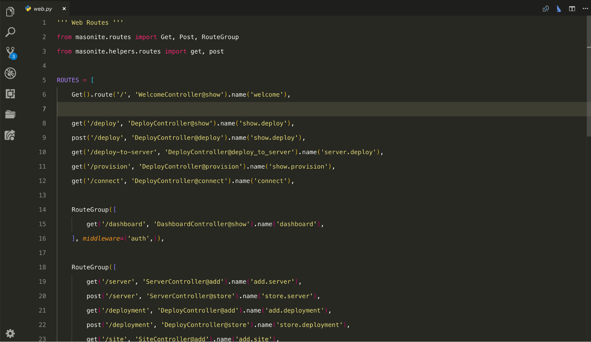

### Can you please introduce yourself and tell me a bit about your background (jobs, education, etc).

My name is Joe Mancuso. I’ve been a developer now for 10 years and currently work in New York in a Lead Software Developer full time position at Rothco, a military and outdoor wholesale company. I am also going to school full time as well to get my B.S in Computer Information Technology as well as the creator of the Masonite Python web framework. I love what I do and it’s a true passion.

I also was in the US Army for 4 years as a Forward Observer Paratrooper (called in fire support like artillery, helicopters and aircraft to support the infantry unit I was attached to) in the 82nd Airborne Division. Very fun experience. Learned a lot about leadership and how to best lead and teach a group of individuals.

### How did you get in to Python? I believe that you have a background in PHP, what made you switch?

I started with PHP when I was around 14 years old. I always wanted to own and run a company and lead people so I thought, and still think, being able to create software is a great way to do that. So I naturally went with PHP because it seemed like an obvious choice for web development at the time and I found some high quality tutorials from “thenewboston”. A YouTube channel designed around programming tutorials. I created a few websites and started building a passion. 

I got kicked out of school at the time for fighting (I was not a good school kid) and I had a lot of time on my hands so I started getting into programming. Getting kicked out of school definitely changed my life for the better. If it wasn’t for that I would probably would not have a career.

That’s what got me into programming and PHP and not until recently, the middle of 2016 did I pick up Python and Django. Usually the middle to end of each year I pick up new tools to learn to get ready for the next year. Each one of the past few years are pre planned in order to compound my knowledge.

* 2015 was learning a lot of what NOT to do with development
* 2016 was learning Python and and how to launch a SaaS (and fail)
* 2017 was learning several types of frameworks and how each one works (Django, Laravel, Custom PHP framework (for work, don’t ask))
* 2018 Design patterns and how to build a framework from scratch while implementing those design patterns explicitly as well as building an online community (Masonite)
* 2019 Devops, containers, provisioning, deployment pipelines etc.
	
Since the December of 2017 I have been all in on Masonite. Working long nights to make it the best framework with the most features as I possibly can while building a great open source organization. All my free time goes into Masonite.

### You are the creator of the Masonite Framework. What made you decide to build another Python web development framework?

Since I had a lot of experience with other web frameworks and being sort of unhappy with Django, I started trying to find Python books at my library. The entire programming section of books at my library is smaller than an endcap of reeses peanut butter cups at my grocery store but the one I found was something like how to build a webserver from scratch or something, maybe a WSGI server. And so I gave it a read and starting to really like the low level stuff that went along with it.
	
So that december I started to poke around with creating a WSGI server which is remarkably simple. You can get a hello world example with like 15 lines of code. 

Before this I was developing a few websites with Laravel to learn that so once I got that WSGI app up I figured that it would be cool to have routes so I can go to different URL’s. So i implemented that and then I thought, coming from Laravel, it would be cool to have Controllers because no Python framework really has them (or so I thought at the time, I believe Pylons has some form of controllers). So i did that and then I started implementing features little by little. I thought it would be cool to have something that does x y and z so I coded that.

A month later I had a very very bare bones framework that was usable. I put a post on Reddit and got shit on on how it sucks and how it can’t even do a, b, c and it wasn’t modular at all. They were all right. My framework was a giant function.

After that I started to break things out and then had an “AHA” moment which was that if I put as much into the core library as possible then I could fix bugs with new releases. Duh. So I made it super modular but at that time I thought it would be cool to create something like Laravel’s IOC container to manage all of the frameworks (and application) dependencies. So I coded that and then came out with a 1.3 release in February. 

I then came up with an awesome plan to come out with a major release every month until June which I would release Masonite 2 no matter which release number I was on. March, April May was 1.3, 1.5 and 1.6. 1.6 was actually pretty incredible already because I was able to muster up some people to join Masonite early on, maybe around 1.5 and I was able to bounce ideas off of them and that really expedited the framework development. 1.6 had a whole bunch of features that were coded by other people like the reloading server which was a huge feature at the time. 

Then as planned I came out with the release of 2.0 in June and it got over 20k views on Reddit and over 90% upvotes. That saw a huge increase in people. Masonite went from around 80 stars i think to probably around 250 in 3 days. Since then it’s been a pretty steady uptrend of people trickling in, taking interest, developing, helping others, writing articles etc. So Masonite is on it’s way to become a pretty successful framework. It’s gonna be an interesting journey to get it to number 1 but I and hopefully others are willing to do some hard work for the next 2,3,4,5,6 years until we are there.

### Masonite is growing in popularity, version 2 has just been released, what plans do you have for the future?

There are some big plans for Masonite 2.1. I’d like to get Masonite into the hallmark level of Python web frameworks, get a few companies using it, make some awesome new features, get Masonite really stable and make only a few minor changes to come out with an LTS of 2.2. Once that is done I think i’ll take the Django approach and create a new paradigm of 3.x after that. And continue that trend of 3.0, 3.1, 3.2, 4.0. But we will see. I don’t want to be constricted to a family of releases for too long unless that x.0 line is very very good. Then we could possibly extend to an x.8 or x.9 release.

As for the current release there will be A LOT more features coming for the 2.1 line. Every few weeks will show a new release. I want to make sure ALL the kinks are out. I like the idea that ANYTHING in the framework should be only a few lines of code. Need to send an email? 2 lines of code. Need to queue to rabbitMQ? 2 lines of code etc.

You are seeing that already with the queue features coming out in the beginning of the 2.1 release. Queueing certain actions is just appending a queue method onto the class.

### How do you manage a full-time job and Masonite? What does a typical day look like for you?

Yeah it’s rough :). I have a full time job, full time student, I am married and have 1 kid. So personal time is not something I have a lot of but I make it work. My wife is very supportive and I am currently down to coding from 9pm to whenever I fall asleep. I spend most of my personal time with my son who is the most awesome kid.

My day on Mondays is just work and school, work from 8a and then I get out at 4:30 so not too bad. Those are my short days. Tuesdays and wednesdays I work from 8am and I usually don’t get home until 9:30p since I have school right after. Thursdays and fridays is the normal 8 - 5 job.

Once i get home I play with the kid until he goes to sleep and do homework and take breaks by coding more Masonite features :). The weekends are usually dedicated to spending time with the family and occasionally will open the laptop to code if I my restless brain syndrome is going strong.

Also throughout the day I will make sure nobody is waiting more than a few minutes to get a reply back from me in the Slack channel. I like being very responsive and got into the habit of it already so can’t do anything about it now :)

### Can you tell me about your local development environment and set-up (a picture would be awesome :-))? What apps do you use everyday?

I use todoist a lot. For pretty much everything from checking logs and making new features to taking out the trash or reminding myself not to leave a notebook behind. That is how I manage most of my time.

For development I use VSCode. Since Masonite works best by having the command line open it helps to be able to bounce back and forth between the editor and the terminal by just hitting a shortcut.

I code on a 2017 13” macbook pro. At work I have a second monitor but mostly just develop on the single small screen. My extra monitor is above my computer though so I’m not constantly swiveling my head back and forth.

I can’t really share a picture since I don’t have a stable place I code, I’ll code on the couch or recliner or kitchen table or bed or living room if I can get comfortable.

Although I can share a picture of my editor. I keep everything very spacious. I like my space :). I also switch around a lot on my colors of choice from week to week just to change things up and keep me creative. Can’t get too complacent :)

### What thing do you enjoy the most about development?

The thing I enjoy most would have to be 2 things I like pretty equally. The first is I love having a community of people who can share ideas openly and freely. Some ideas are crap, some ideas are great but they are all treated equally. I love explaining things to people in a way that makes sense to them and seeing that aha moment when everything clicks for me. 

The second is I love building things that people use. I love it when they see it and are amazed but I love it even MORE when things start breaking or things don’t work the way they should. The first reason is because I like the challenge of taking a problem and searching for a solution and secondly, if things are breaking then that means people are using it and that means Masonite is making progress towards being better.

Not everything can be solved on the first try so being able to reiterate some features over and over to get it just right and find the pain points is really thrilling.

### And the worst?

The worst is probably having to debug an issue that only happens sometimes. These types of issues put me in a crap mood because i LOVE when things make sense. I’m actually obsessed with things making sense. I question everything until i understand it. 

I’ve always said that:

> The only thing worse than something not working and not knowing why is something working and not knowing why. And the only thing worse than that is when something is working sometimes and you don’t know why.

Very frustrating and those are the worse issues to deal with. Those put me in a bad mood usually lol. Whenever I am crabby my wife usually says “something not working, huh?”. She knows.

### Do you have any hobbies outside the computer?
	
Ummm. Not really actually. Since i’ve had a kid there isn’t much free time to do many hobbies outside of this one.

### If tomorrow, you could only visit one website, which one would you pick and why?
	
This is a really good question. If i could only pick one website I would probably pick YouTube. The sheer knowledge base of YouTube is grossly undervalued. Since I was a kid i have been obsessed with learning. From about 9 years old or onwards I watched only the history channel. Still today if I watch TV i watch only national geographic or discovery or something. I actually love watching Air Disasters. I can watch that for hours. I’ll watch anything educational. From wwII documentaries to Python tutorials to how to change oil on a 1969 Camaro. It’s the knowledge I’m after which bodes well in conversations. I can talk to pretty much anybody about anything anytime just because i’ve been able to focus solely on knowledge building free time since I was a kid.

But anyways, yeah I would go to YouTube and just watch educational talks, tutorials, etc. There's no better investment than investment in your brain. 

### Finally, where can people find you online and find out more about Masonite?

They can follow me personally at [@JoeMancusoDev](https://twitter.com/JoeMancusoDev) or Masonite [@masoniteproject](https://twitter.com/masoniteproject) on Twitter. I put out most of my personal thoughts there and any Masonite related news.

You can also join the [Masonite Slack channel](http://slack.masoniteproject.com) if you need to ask me questions personally about whatever you want.
