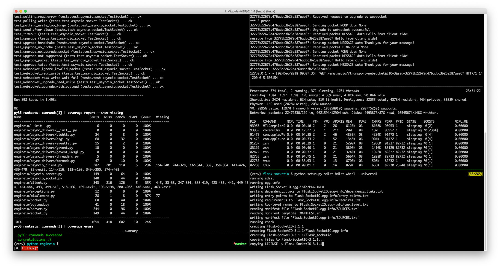

### Hi Miguel, can you please introduce yourself and tell me a bit about your background.

Hi! My name is Miguel Grinberg. I taught myself how to code in my teenage years, and later solidified my knowledge with a Masters degree in Computer Science. I held a variety of software development jobs over the years in a variety of areas including computer animation, radio station automation, interactive television, video streaming, web services and cloud infrastructure.

### How did you get in to Python?

Like most teenagers of my generation, I learned to code with the Basic language. My second language was, believe it or not, Assembly. I then transitioned to C, and later C++. My first introduction to Python was as a wrapper language for a large and complex C++ library that needed to be more accessible. I wrote Python bindings for this library and liked the language so much that I then incorporated it into many other projects.

### Most people will know you best for your Flask Mega-Tutorial and Flask Web Development book, what is it about Flask? Or do you just love teaching?

My association with Flask started with a personal project of mine. This was a few years back, at a time where everybody had a blog or at least wanted to start one. Going with the times, I had decided I wanted to start a software development blog, and since I wasn’t very excited about the blogging platforms available in those days, I decided to code my own. 

I knew that I wanted to use Python, but I had no experience with any web frameworks. So, I did a little review of what was out there and came up with three possible candidates: [Django](https://www.djangoproject.com/), [Bottle](https://bottlepy.org/docs/dev/) and [Flask](http://flask.pocoo.org/). 

I started with Django and found it to be too structured for my taste. I then moved to Bottle and liked it a lot, but found the lack of extensions for things such as authentication a bit limiting. Flask was similar to Bottle, but had a slightly larger community and a few more extensions, so that is why I chose it over Bottle. 

One disadvantage Flask and Bottle had with respect to Django was that there wasn’t much content besides the official documentation. So as soon as I completed my blog I knew exactly what to blog about! This is when the idea of writing an extensive tutorial came about, so I set off to write the [Flask Mega-Tutorial](https://blog.miguelgrinberg.com/post/the-flask-mega-tutorial-part-i-hello-world), plus a few other smaller Flask tutorials and stand alone articles over the following years.

### If you had to start building a new web application today, what would be in your 'stack' and why? 

I would use Flask, but I’m sure you could’ve guessed that! For most projects, using an asynchronous server is overkill, so my favorite backend stack is Flask running on a Gunicorn web server with nginx in front. For caching I find Redis extremely easy and fun to use. For storage in general I favor relational databases, so often I end up using Flask-SQLAlchemy and Flask-Migrate.

If the project is one of those special ones that can benefit from asynchronous server, I had great success using Eventlet’s asynchronous web server with Flask. I wish this was a more popular combination, because Eventlet’s way of doing async is very straightforward compared to the pain of migrating to something like asyncio, where you need to replace your entire stack.

From time to time I venture into frontend development, and for this I’m sad to say that I don’t have any favorite technology or stack that I like. From all the modern frontend frameworks the one that I dislike the least is React, but in general I enjoy writing frontend applications in native JavaScript, or just using very lightweight frameworks such as jQuery or Backbone.

### You are a Software Developer, author, blogger, speaker, teacher. What does a day in the life of Miguel Grinberg actually look like? 

I have been lucky to find work in the areas I’m interested in. In the jobs that I held in the last few years I have always been writing Flask based services, usually in combination with some of my own open source projects. Besides regular work, I spend at least an hour a day tending to issues or questions posted in my open source repos or StackOverflow. I also try to spend at least a little bit of time every day on some of my personal projects or open source.

### Can you tell us about your development environment and workflow? What software or apps couldn't you live without?

The two apps I cannot live without are [vim](https://www.vim.org/) and [tmux](https://github.com/tmux/tmux/wiki). 

Vim is a very powerful terminal based text editor that runs pretty much anywhere. What I like the most about it is that I can use it locally on my laptop as well as on any remote server I might be connected to. 

Tmux is a terminal multiplexer, which you can use to create persistent terminal sessions in any servers, local or remote. Vim combined with tmux allows me to create complex layouts with multiple terminals, and once again, this works exactly the same in my laptop or in a cloud server. You can see an example tmux terminal layout I’m currently using in this screenshot:

Sometimes I also use Python IDEs, specially because they have nice interactive debugging capabilities. I cannot really decide on a favorite between [PyCharm](https://www.jetbrains.com/pycharm/) and [Visual Studio Code](https://code.visualstudio.com/). PyCharm is very robust, but has a bit of a performance problem with large projects. Visual Studio Code is faster, but isn’t as robust as PyCharm. I have both installed and keep bouncing back and forth between the two.

### Do you have any hobbies outside the computer?

Yes. I play Ukulele and Mandolin. I have a few of instruments within reach of my desk, actually. Whenever I need to take a break, or if I need to wait for a build to finish I play a tune or two! 

I also have an interest in photography, filmmaking and animation. I’m very proud of the little video I did of the 2017 solar eclipse, assembled from about 350 pictures I took with my DSLR. It was specially challenging to have to change the camera setup completely between the partial and total phases of the eclipse, while at the same time trying to also enjoy the eclipse with my own eyes!

`youtube:https://www.youtube.com/embed/2-PJSc_OsQo`

### If the internet didn't exist, what do you think that you would be doing as a full time job?

Given that I started working as a software engineer before the Internet became such an important part of our lives, I’d say that without Internet I would probably still be coding. I started my career working on desktop and embedded software, neither of which required a network connection, so I would probably still be doing that.
 
Now if what you really wanted to ask is what I would be doing if computers didn’t exist, I’d like to think that I would be able to have a career in filmmaking, either directing, scriptwriting or both.

### If you were stranded on a desert island, what 3 things would you take with you?

Being able to get three things and not just one is very generous on your part! Firstly, I think I would like to have a saw, knife or similar tool, since I suppose I would be building myself a little house on the island and something sharp to cut things would be hard to find. Next I would probably want a large (really large) box of matches, because I don’t think I’d have the patience to start fires with sticks. Last I would need something to pass the time, and for that I would like to have an acoustic stringed instrument, preferably one of my ukuleles, but would settle for a guitar or even a violin!

### Finally, what advice would you give to someone who wanted to learn programming today?

Unfortunately learning programming today is somewhat difficult, mainly because there are too many technologies, and in many cases you need to know a few of them to get something done by yourself. For example, if you wanted to make a web application, you have to know some HTML, some CSS, some JavaScript, and you also need to pick a backend language out of dozens of them. And I haven’t got in to choosing frameworks for all of these!

When I learned to program the only accessible option you had on personal computers was the Basic language, so really there wasn’t much to think about. In my opinion Python is a really good first language to learn today, like Basic was for me (and Python is a much better language than Basic ever was). 

My recommendation is to come up with a first project that can improve some aspect of your life, and then direct your learning from books, YouTube, Stack Overflow, friends or anything else you have at hand to the completion of the project. I learned to code when I was a teenager, and my first serious project was a little program that helped me complete some really nasty homework assignments I used to get in school for my Accounting class (I spoke about this and other early projects of mine in the keynote I gave at PyCon Ireland, hopefully it will eventually show up on YouTube for those who weren’t there). What’s great about doing something that has a value besides the learning is that you are more likely to complete it because you have a vested interest in the project.

A formal education in computer science is also something I would strongly recommend to those that are serious about having a career in software development. I had a few years of coding experience when I started studying Computer Science at University, and yet, after I learned the theory behind networks, databases, CPUs, compilers and so on I saw things I thought I already knew in a completely new light!
